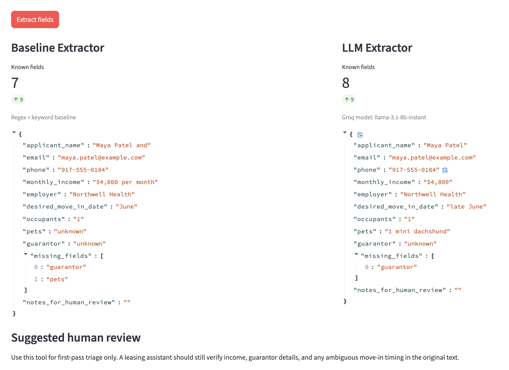

# LeaseLens: AI Rental Application Extractor

LeaseLens is a narrow GenAI workflow tool for leasing assistants and property managers. It takes a free-form rental application email or applicant note, extracts the key fields needed for review, and flags missing information for human follow-up.

## Context, User, and Problem

The target user is a leasing assistant or property manager reviewing rental applications that arrive as unstructured text. In many small leasing workflows, applicants send emails or short notes instead of filling out a strict form. Staff then have to manually read each message, copy details into a spreadsheet or property system, and follow up on anything missing.

This project improves one specific workflow:

1. Read a rental application message.
2. Extract the core screening fields.
3. Identify what information is still missing.
4. Hand the result to a human reviewer for next-step follow-up.

This matters because manual first-pass review is repetitive, easy to get wrong, and slows down response time when applications are incomplete.

## Solution and Design

I built a small `Streamlit` app plus an evaluation script for a focused extraction workflow.

The app takes a rental application email or note and produces a structured review record with:

- applicant name
- email
- phone
- monthly income
- employer
- desired move-in date
- occupants
- pets
- guarantor
- missing fields
- notes for human review

### How it works

The project includes two extractors:

- A rule-based baseline using regex and keyword matching
- An LLM-based extractor using Groq's OpenAI-compatible API

The baseline is intentionally simple. It works best when the text uses obvious patterns such as standard phone numbers, email addresses, explicit monthly income phrasing, or clear pet statements.

The LLM extractor is useful because rental applications are often semi-structured. Applicants may write things like:

- "I bring home around 4.8k a month"
- "My partner and I are hoping to move in late June"
- "My aunt can co-sign if needed"

Those variations are harder to capture with pure rules. The GenAI workflow is designed to help with interpretation and missing-information detection, not final approval.

### Key design choices

- The scope is intentionally narrow: one user, one workflow, one document type
- The system compares GenAI against a simpler baseline instead of assuming the LLM is automatically better
- The output is structured so a human can scan it quickly
- The tool is positioned as first-pass triage, not autonomous decision-making

## Evaluation and Results

I evaluated both systems on `12` synthetic rental application cases with easy, medium, and hard examples. The cases include:

- standard applications with explicit fields
- informal emails
- missing information
- ambiguous dates
- multiple applicants
- students and freelancers
- guarantor edge cases

### Baseline

The baseline is a regex and keyword extractor. It is the simpler comparison point and represents how a lightweight non-LLM workflow might work in practice.

### Evaluation rubric

I used four metrics:

- `field_accuracy`: average exact-match accuracy across extracted fields
- `missing_field_accuracy`: how well the system identified missing information
- `case_completion_accuracy`: strict all-fields-correct accuracy for a full case
- `triage_success_rate`: a workflow-oriented metric where a case counts as useful for triage if `field_accuracy >= 0.70` and `missing_field_accuracy >= 0.80`

The strict full-case metric is intentionally hard. Even a small mismatch counts as failure, so it captures reliability for end-to-end automation rather than partial usefulness.

### Results

I ran both the baseline and the LLM workflow on the 12-case synthetic evaluation set. The results were:

| Metric | Baseline | LLM |
|---|---:|---:|
| Field accuracy | 0.806 | 0.722 |
| Missing-field accuracy | 0.789 | 0.944 |
| Full-case completion accuracy | 0.333 | 0.000 |
| Triage success rate | 0.583 | 0.333 |

### What I found

The baseline performed better on exact field extraction and on overall triage success in this small evaluation. That makes sense because many examples still contained patterns that regex and keyword rules could capture reliably.

The LLM performed much better on missing-field detection. This suggests that the most useful business value of GenAI in this workflow is not perfect extraction, but identifying incomplete applications that need human follow-up.

In other words:

- the baseline was more reliable for exact structured extraction
- the LLM was better at spotting missing information
- the best use case for GenAI here is first-pass triage, not full automation

### Limitations and human involvement

This tool has clear failure modes:

- annual income may be confused with monthly income
- multiple applicants can blur names, employers, and occupant counts
- vague timing like "late June" is not precise enough for downstream systems
- exact-match evaluation can penalize outputs that are directionally useful but phrased differently

A human should still stay involved for:

- final screening decisions
- income verification
- guarantor verification
- conflict resolution when the application is incomplete or ambiguous

## Artifact Snapshot

The screenshot below shows the actual app running on a sample rental application. The baseline extractor is on the left and the LLM extractor is on the right.



In this example:

- the baseline slightly mangles the applicant name and misses the pet field
- the LLM handles the informal wording better and extracts the pet information
- both outputs still require human review before any final leasing decision

## Setup and Usage

### Requirements

- Python 3
- A Groq API key stored in `GROQ_API_KEY`

### Install

```bash
cd "/Users/mac/Downloads/RL/Generative AI FP"
python3 -m pip install -r requirements.txt
```

### Run the app

Set your API key:

```bash
export GROQ_API_KEY=your_key_here
```

Start the app:

```bash
streamlit run app.py
```

Then:

1. Open the local Streamlit URL in your browser.
2. Choose one of the built-in examples from the dropdown.
3. Click `Extract fields`.
4. Compare the baseline output and the LLM output.

### Run one example through the evaluation script

Baseline only:

```bash
python3 evaluate.py --mode baseline
```

Baseline + LLM:

```bash
export GROQ_API_KEY=your_key_here
python3 evaluate.py --mode both
```

The evaluation writes:

- [results/evaluation_summary.csv](/Users/mac/Downloads/RL/Generative AI FP/results/evaluation_summary.csv)
- [results/case_results.csv](/Users/mac/Downloads/RL/Generative AI FP/results/case_results.csv)

## Repository Structure

```text
.
├── app.py
├── extractor_baseline.py
├── extractor_llm.py
├── evaluate.py
├── schema.py
├── data/
│   ├── examples.json
│   └── eval_cases.json
├── assets/
│   └── artifact_snapshot.png
├── results/
│   ├── case_results.csv
│   └── evaluation_summary.csv
└── requirements.txt
```
